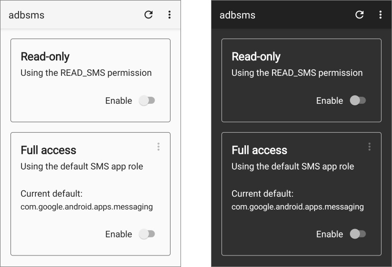

# adbsms

A simple Android app that exposes an unprotected `ContentProvider` that relays
operations to the SMS Provider, allowing messages to be queried and modified
over adb without causing a `SecurityException` due to missing permissions.

<p align="center">

</p>

<br />

> [!CAUTION]
> All SMS Provider operations are guarded by dangerous permissions. This app
> effectively bypasses the security and privacy measures provided by that
> mechanism, and could potentially be exploited by a malicious actor. It should
> be disabled or uninstalled when not in use. <b>Use at your own risk!</b>

<br />

## Overview

The app offers two levels of access to the SMS Provider:

+ Read-only, by acquiring the `READ_SMS` permission.

  This option is the most straightforward of the two. However, on Marshmallow
  and above, you will be able to view only Inbox and Sent messages.

+ Full access, by assuming the default SMS app role.

  This one will grant you full read and write access on each applicable version,
  but your messaging will be largely nonfunctional while adbsms is the default.
  The only fallback facility currently provided is (optional) incoming SMS
  processing and storage. Nothing else is handled, aside from some very
  simplistic event logs, and there is no way to send anything out.

After enabling the desired option, queries can be made like they usually are
over adb by replacing the authority in any `content://sms` URI with `adbsms`.

### Examples

You can consult adb's documentation for further details, but these few examples
should at least clarify the proper usage.

To list the number and text for all (viewable) messages:

```
adb shell content query --uri content://adbsms --projection address:body
```

Or just the Sent messages:

```
adb shell content query --uri content://adbsms/sent --projection address:body
```

Or, to list all columns for the message with ID 137:

```
adb shell content query --uri content://adbsms/137
```

If you've set adbsms as the default SMS app, you can also delete messages:

```
adb shell content delete --uri content://adbsms/137
```

Or update an existing one:

```
adb shell content update --uri content://adbsms/137 --bind body:s:"Updated\ text"
```

Or insert a new one:

```
adb shell content insert --uri content://adbsms --bind body:s:"Draft\ text" --bind type:i:3
```

The `type` column corresponds to the `MESSAGE_TYPE_*` values from the
[`Telephony.TextBasedSmsColumns`][columns] contract, which are summarized in the
following table.

### Message types

| Type   | Value |
|--------|:-----:|
| All    |   0   |
| Inbox  |   1   |
| Sent   |   2   |
| Draft  |   3   |
| Outbox |   4   |
| Failed |   5   |
| Queued |   6   |

<br />

## Notes

+ If you plan to use the default SMS app option in order to get at the hidden
  types, you should know that not all SMS apps utilize each one. Though most
  use Inbox and Sent consistently, it seems that many apps simply don't use
  Draft and/or the others at all. I'm guessing they save those messages to
  internal storage instead, for some reason. Just a heads up.

+ If you need to use the Full access option on Lollipop, API levels 21 or 22,
  you will need to un-comment the `WRITE_SMS` permission in the manifest (and
  probably suppress a warning or two, as well).

+ I haven't implemented every possible `ContentProvider` operation in
  [`AdbSmsProvider`][provider], but it does cover all of the required overrides.
  I _think_ that should be sufficient for everything that adb can do, but if you
  find something I've missed, please [file an issue][issue] for it.

[columns]: https://developer.android.com/reference/android/provider/Telephony.TextBasedSmsColumns

[provider]: app/src/main/kotlin/dev/gonodono/adbsms/AdbSmsProvider.kt

[issue]: https://github.com/gonodono/adbsms/issues/new