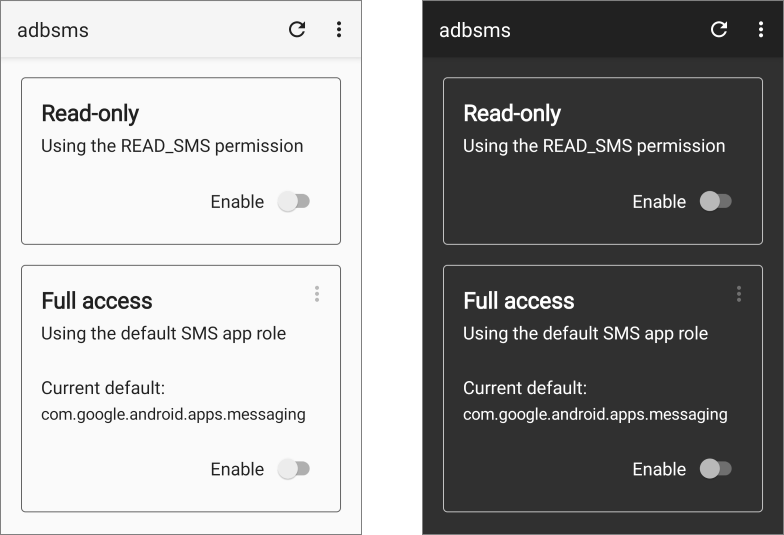

# adbsms

<!--suppress HtmlDeprecatedAttribute -->


A small and simple Android app with a `ContentProvider` that can act as a relay
between `adb` and the system SMS Provider, allowing for access workarounds in
environments with insufficient permissions and/or message restrictions. For
example:

- The shell may lack some or all of the necessary SMS permissions, leading to
  possible `SecurityException`s and other failure modes.

- On Marshmallow and above, non-default apps can see only `inbox` and `sent`
  messages, and the shell may be constrained to the same restricted view.

<br />

## Contents

- [**Overview**](#overview)
- [**Examples**](#examples)
- [**Headless <sup>New</sup>**](#headless-new)
- [**Minimal <sup>New</sup>**](#minimal-new)
- [**Download**](#download)
- [**Notes**](#notes)

<br />

## Overview

<br />

<!--suppress HtmlDeprecatedAttribute -->
<p align="center">
    <!--suppress CheckImageSize -->
    
</p>

<br />

The app offers two levels of access to the SMS Provider:

- **Read-only**, by acquiring the `READ_SMS` permission

  This option is the most straightforward of the two. However, on Marshmallow
  and above, you will be able to view only `inbox` and `sent` messages.

- **Full access**, by temporarily assuming the default SMS app role

  This one will grant you full read and write access on each supported version,
  but your messaging will be largely nonfunctional while adbsms is the default.
  The only fallback facility currently provided is (optional) incoming SMS
  processing and storage to the Provider. Nothing else is handled, aside from
  some very simplistic event logs for a few things, and there is no way to send
  anything out.

After enabling the desired option, queries can be made as they normally are over
`adb` by replacing the authority in any `content://sms` URI with `adbsms`. See
the [Examples](#examples) below.

If you'd rather toggle these access options from the shell, consult the
[Headless](#headless-new) section.

Should you not need the UI at all, the [Minimal](#minimal-new) version might be
preferable.

<br />

> [!NOTE] 
> The app's UI does _not_ need to be open while running queries. It's not
> involved in Provider operations.

<br />

## Examples

You'll have to check `adb`'s documentation for details on all of its available
options, but these few examples should at least clarify the URI modification
necessary to access this app's Provider.

To list the number and text for all (viewable) messages:

```
adb shell content query --uri content://adbsms --projection address:body
```

Or just the `sent` messages:

```
adb shell content query --uri content://adbsms/sent --projection address:body
```

Or, to list all columns for the message with ID 137:

```
adb shell content query --uri content://adbsms/137
```

If you've set adbsms as the default SMS app, you can also delete messages:

```
adb shell content delete --uri content://adbsms/137
```

Or update an existing one:

```
adb shell content update --uri content://adbsms/137 --bind body:s:"Updated\ text"
```

Or insert a new one:

```
adb shell content insert --uri content://adbsms --bind body:s:"Draft\ text" --bind type:i:3
```

The `type` column corresponds to the `MESSAGE_TYPE_*` constants from the
[`Telephony.TextBasedSmsColumns`][contract] contract, the values for which are
collated here for convenience:

<table>
  <tbody>
    <tr>
      <td><code>all</code></td>
      <td><code>inbox</code></td>
      <td><code>sent</code></td>
      <td><code>draft</code></td>
      <td><code>outbox</code></td>
      <td><code>failed</code></td>
      <td><code>queued</code></td>
    </tr>
    <tr>
      <td align="center">0</td>
      <td align="center">1</td>
      <td align="center">2</td>
      <td align="center">3</td>
      <td align="center">4</td>
      <td align="center">5</td>
      <td align="center">6</td>
    </tr>
  </tbody>
</table>

<br />

## Headless <sup>New</sup>

The app's UI can be bypassed entirely, if desired. As with any app, both the
permission and the default app status can be set through the relevant Settings
pages, manually or programmatically, if such a flow would better suit your
needs.

Alternatively, it can all be handled through the shell, as the rest of this
section demonstrates.

### Read-only setup

This option requires only a single permission, and the command is the same on
all supported Android versions.

```
adb shell pm grant dev.gonodono.adbsms android.permission.READ_SMS
```

Should you need to revoke it later, change the `pm` command accordingly.

```
adb shell pm revoke dev.gonodono.adbsms android.permission.READ_SMS
```

### Full access setup

The default SMS app status is handled as a `Role` on API levels 29 (Q) and
above, and the applicable `adb` commands change across that same version.

#### API levels 29+

You'll want to reset the previous default once you're done. This command should
return (at most) one application ID.

```
adb shell cmd role get-role-holders android.app.role.SMS
```

To set this app as the default, we use the add command. Since this is an
exclusive role, add acts as a setter.

```
adb shell cmd role add-role-holder android.app.role.SMS dev.gonodono.adbsms
```

Call the add command again with the previous app when finished. If there wasn't
one set, you can use `remove-role-holder` instead, but you might get an
`Exception` if the system tries to inspect the new default without checking. The
remove will likely still work; it may just complain about the missing value.

#### API levels < 28

The old method involves fiddling with `Settings.Secure` through `adb`.
Retrieving the current value is straightforward:

```
adb shell settings get secure sms_default_application
```

…as is setting a new value:

```
adb shell settings put secure sms_default_application "dev.gonodono.adbsms"
```

…then call `put` again with the previous default when done, or `delete` if none.

Unfortunately, I'm not sure that this method is reliable everywhere since the
`sms_default_application` key is hidden from the SDK. A potential fallback could
be had by launching the default app change action.

```
adb shell am start -a android.provider.Telephony.ACTION_CHANGE_DEFAULT --es package "dev.gonodono.adbsms"
```

Some sort of UI interaction would be required since this does display a dialog,
though it is relatively simple and amenable to the standard automation tools.

<br />

## Minimal <sup>New</sup>

A zero-frills, no-UI version is now available in the `:min` module. It's meant
for headless use in scripts, with agents, etc. The only class it contains is the
relay `ContentProvider`, and its access options must be handled through Settings
or the shell.

This minimal version has a distinct application ID – `dev.gonodono.adbsms.min` –
and its own content authority – `adbsms.min` – so it can be installed alongside
the main app. (Yes, there is a dot in the authority. This pattern makes for
clear and consistent identifiers everywhere.)

This version also can assume the default SMS app role for full access, since it
has all the necessary components registered. However, none of the underlying
classes actually exist, and attempts to access any of them will result in
`Exception`s.

Consequently, the minimal app does _not_ offer the incoming SMS storage
fallback. Indeed, messaging is completely nonfunctional while adbsms.min (actual
app name) is the default.

### Command line changes

The only differences here are the application ID and authority substitutions,
which amount to appending the `.min` suffix to the main app's identifiers.

For instance, to set up read-only access, amend the application ID in the
command given [above](#read-only-setup).

```
adb shell pm grant dev.gonodono.adbsms.min android.permission.READ_SMS
```

The first query from the [Examples](#examples) would have the authority changed
thusly:

```
adb shell content query --uri content://adbsms.min --projection address:body
```

The second one similarly so:

```
adb shell content query --uri content://adbsms.min/sent --projection address:body
```

Et cetera.

<br />

## Download

Each new version is accompanied by [a GitHub release][latest] with assets that
contain `apk`s of release build variants of both `:app` and `:min` signed with a
debug key, which is the current setup in each module's `build.gradle.kts`. These
apps aren't published anywhere, as they're intended to be sort of homebrew tools
for developers and power users, and the unusual configuration is used to apply
ProGuard and whatnot to "unsigned" builds.

I'm not encouraging anyone to prefer the pre-built APKs; they're simply a
convenience for users who don't have the setup available to do it themselves, or
anyone who just wants a quick test. They're assembled using GitHub Actions and
[this local workflow][workflow], so you can be reasonably certain that there are
no malicious injections or modifications.

The GitHub releases for automated builds will be created by user
`github-actions`, whose name links to https://github.com/apps/github-actions,
which actually redirects elsewhere if followed. Workflow execution details can
be found on [the Actions tab][actions].

<br />

## Notes

### Minimum Android versions

The `minSdk` for the `:app` module is 24 (Nougat). If you need that to be lower
and you're cloning the repo, I'll assume that you can figure out where to add
the necessary checks and such. If anyone really needs the pre-built APK to
support prior versions, [file an issue][issue] as a request for the desired
minimum and I'll see what I can do.

The `minSdk` for the `:min` module is 19 (KitKat), which is the version that
introduced the official SMS API. I doubt that anyone is running anything that
old anymore, but it would be the same code with any newer version too, so might
as well.

### Supported Provider operations

I haven't implemented every possible `ContentProvider` operation in either [the
main `AdbSmsProvider`][provider] or [the minimal one][provider.min], but they do
cover all the required overrides. I _think_ that should be sufficient for
everything that `adb` can do, but if you find something I've missed, please
[file an issue][issue] for it.

### Full access limitations

If you plan to use the **Full access** option in order to get at the hidden
message types, you should know that not all SMS apps utilize each one. Though
most use `inbox` and `sent` consistently, it seems that many apps don't use
`draft` and/or the others at all. Apparently they save those messages to
internal storage instead, for whatever reason. Just a heads-up.

### No more golf

Ever since I added the automated build and release, I've been working to shrink
(golf) the APK by various means, mainly as a selling point, I guess. I won't be
doing that anymore, since there's now a separate module dedicated to a minimal
size implementation. I'll generally try to keep things small, but `adbsms.apk`'s
size may fluctuate in the future, rather than decreasing monotonically.

It should also be noted that `:min` is about as bare-bones as is feasible, so
even small differences between build tool versions may be enough to effect
`adbsms.min.apk`'s size, which is therefore liable to fluctuate as well.

### Bug reports

Please report any bugs or other problems encountered in using this project
[here][issue].

<br />

## License

MIT License

Copyright (c) 2026 Mike M.

Permission is hereby granted, free of charge, to any person obtaining a copy of
this software and associated documentation files (the "Software"), to deal in
the Software without restriction, including without limitation the rights to
use, copy, modify, merge, publish, distribute, sublicense, and/or sell copies of
the Software, and to permit persons to whom the Software is furnished to do so,
subject to the following conditions:

The above copyright notice and this permission notice shall be included in all
copies or substantial portions of the Software.

THE SOFTWARE IS PROVIDED "AS IS", WITHOUT WARRANTY OF ANY KIND, EXPRESS OR
IMPLIED, INCLUDING BUT NOT LIMITED TO THE WARRANTIES OF MERCHANTABILITY, FITNESS
FOR A PARTICULAR PURPOSE AND NONINFRINGEMENT. IN NO EVENT SHALL THE AUTHORS OR
COPYRIGHT HOLDERS BE LIABLE FOR ANY CLAIM, DAMAGES OR OTHER LIABILITY, WHETHER
IN AN ACTION OF CONTRACT, TORT OR OTHERWISE, ARISING FROM, OUT OF OR IN
CONNECTION WITH THE SOFTWARE OR THE USE OR OTHER DEALINGS IN THE SOFTWARE.


[contract]: https://developer.android.com/reference/android/provider/Telephony.TextBasedSmsColumns
[latest]: https://github.com/gonodono/adbsms/releases/latest
[workflow]: .github/workflows/build_and_release_apk.yaml
[actions]: https://github.com/gonodono/adbsms/actions
[issue]: https://github.com/gonodono/adbsms/issues/new
[provider]: app/src/main/kotlin/dev/gonodono/adbsms/AdbSmsProvider.kt
[provider.min]: min/src/main/java/dev/gonodono/adbsms/min/AdbSmsProvider.java